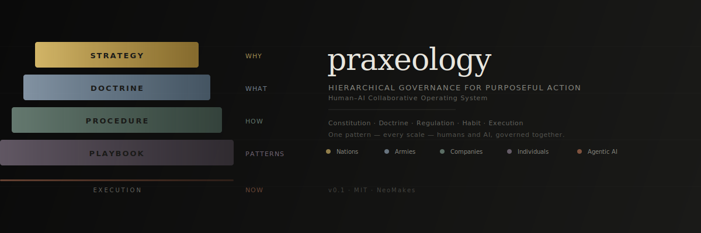

<p align="center">
  
</p>

<p align="center">
  
  
  
  
</p>

<p align="center">
  <a href="README.md">English</a> ·
  <a href="README.ko.md">한국어</a> ·
  <a href="README.ja.md"><strong>日本語</strong></a> ·
  <a href="README.zh.md">中文</a> ·
  <a href="README.fr.md">Français</a> ·
  <a href="README.de.md">Deutsch</a> ·
  <a href="README.es.md">Español</a>
</p>

<p align="center">
  <a href="docs/quickstart.md">Quick Start</a> (<a href="docs/quickstart.ko.md">한국어</a> · <a href="docs/quickstart.ja.md">日本語</a> · <a href="docs/quickstart.zh.md">中文</a> · <a href="docs/quickstart.fr.md">FR</a> · <a href="docs/quickstart.de.md">DE</a> · <a href="docs/quickstart.es.md">ES</a>) ·
  <a href="docs/role-design.md">Role Design</a> (<a href="docs/role-design.ko.md">한국어</a> · <a href="docs/role-design.ja.md">日本語</a> · <a href="docs/role-design.zh.md">中文</a> · <a href="docs/role-design.fr.md">FR</a> · <a href="docs/role-design.de.md">DE</a> · <a href="docs/role-design.es.md">ES</a>)
</p>

---

## 問題

**並列化は解決済みだ。**  これらのツールはすでに個々のAIエージェントを驚くほど生産的にしている。5つのエージェントを並列で実行することは解決済みの問題だ。

**調整は違う。** その5つのエージェントが作業を終えたとき、誰が競合を解決するのか？誰が一貫性を検証するのか？誰がエージェントAがエージェントBの決定を上書きするのを防ぐのか？誰がセッション間でのロールドリフトを止めるのか？マルチエージェントフレームワークは*開始*を解決する — Praxeologyはその後を解決する: **調整、状態追跡、競合解決、進化的整合。**

**Praxeologyは欠けていたガバナンスレイヤーだ。** コーディングツールの上に位置し、それらを置き換えるのではなく — エージェントが独立したチャットボットの集合ではなく、一貫した組織として運営されることを保証する。

---

## 本番環境での実証

これは理論ではない。[NeoMakes](https://neomakes.com)はこれを毎日運用している。

> **1人 + 9つのAIエージェント · 38のガバナンスルール · 7つの部門**
> 日次タスク → 週次レビュー → 月次改訂
> エージェントがギャップを検出し、修正案を提案し、自らのSOPを進化させる。

各エージェントには **Speech Rules**（文章数制限、トーン）、**Anti-Patterns**（禁止行動）、**Emotional Triggers**（状況依存の応答変化）が定義されており — 9つのエージェント全体で一貫性のある識別可能な行動を保証する。NeoMakesは一例だ。あなたのものは異なる形になるだろう。

---

## 仕組み

4+1階層ガバナンス構造。シンプル。普遍的。

```
戦略 (WHY) → ドクトリン (WHAT) → 手順 (HOW) → プレイブック (PATTERNS) → 実行 (NOW)
```

上位階層は常に下位階層を上書きする。例外なし。エージェントは状況をカバーする最初のレベルで停止しながら、階層を上って意思決定を解決する。

---

## 何が違うのか

機能リストではない。調整問題の解決者だ。

| あなたの問題 | Praxeologyの答え |
|---|---|
| エージェントがセッション間でロールからドリフトする | **ConstitutionalGuard** — 4層行動検証 |
| エージェントの行動を安全に制約する方法がない | **SafetyGate** — 上位階層が下位階層では上書きできない重要ルールをロックする |
| エージェントが自らのプロセスを改善できない | **SOP Evolution** — Learn-Compress-Applyループ。ガバナンスのための勾配降下法 |
| ある場所の変更が別の場所を壊す | **Review Cascade** — 双方向伝播（階層の上下方向） |
| エージェントがルールが悪いときにフラグを立てられない | **Proposal Flow** — 任意のエージェントからファウンダーへの構造化された改訂リクエスト |
| セッション間で組織的記憶がない | **Work Cycle** — 日次ギャップ → 週次提案 → 月次改訂 → 四半期レビュー |

---

## クイックスタート

```bash
git clone https://github.com/neomakes/praxeology.git my-org
cd my-org
bash setup.sh    # 対話型ウィザード: 組織名、ミッション、部門、エージェント
bash launch.sh   # ガバナンスシステムが稼働
```

> **初めての方は？** [クイックスタートガイド](docs/quickstart.md)と[ロール設計ガイド](docs/role-design.md)から始めてください。

---

## エージェント設計システム

すべてのエージェントは、*何を*するかだけでなく、*どのように*振る舞うかを定義する `CLAUDE.md` を受け取る:

```
Identity → Persona → Speech Rules → Anti-Patterns → Emotional Triggers → Values → Boundaries
```

これによりエージェントは**識別可能で、一貫性があり、境界が明確**になる。QAエージェントはエグゼキューターとは異なる話し方をする。プランナーは決してコードを書かない。レビュアーは自分の作業を決して承認しない。完全なテンプレートとスケーリング戦略（3〜15名以上のエージェント）については[ロール設計ガイド](docs/role-design.md)を参照。

---

## サンプル

- [examples/solo-dev/](examples/solo-dev/) — ソロ開発者 + 3エージェント（最小構成）
- [examples/tech-startup/](examples/tech-startup/) — 初期段階のソフトウェア会社
- [examples/one-piece-crew/](examples/one-piece-crew/) — 完全なペルソナシステムを持つ架空のクルー

---

<details>
<summary><strong>理論 — なぜこれが機能するのか（同型性）</strong></summary>

同じ4+1階層構造は、組織的行動のあらゆる領域に現れる:

| 階層 | 国家法 | 軍事 | 企業 | 個人 | AIエージェント |
|------|-------------|----------|-----------|------------|----------|
| **1 戦略** | 憲法 | 作戦目標 | ミッション & ビジョン | 個人の価値観 | System Prompt / Prime Directive |
| **2 ドクトリン** | 成文法 | 交戦規則 | 企業ポリシー | 人生の原則 | 行動ガイドライン |
| **3 手順** | 規則 | 標準作戦手順 | SOP / プロトコル | 習慣 & ルーティン | タスク指示 |
| **4 プレイブック** | 判例法 / 先例 | 戦術 & 訓練 | ベストプラクティス | 学習パターン | Few-shot例 |
| **実行** | 行政命令 | 任務命令 | スプリント / 作業計画 | 日次タスク | アクティブコンテキスト |

ガバナンスはドメイン固有ではない。パターンは普遍的だ。軍事部隊に機能するフレームワークは、スタートアップ、研究ラボ、AIエージェントフリートにも機能する。

</details>

---

## ディレクトリ構造

```
your-org/
├── CLAUDE.md                  # AIエージェント用ルートコンテキスト（生成済み）
├── launch.sh                  # 日次起動スクリプト（生成済み）
├── _standard/                 # ガバナンス文書
│   ├── README.md              # 全ガバナンス成果物のマスターインデックス
│   ├── {department}/          # 部門ごとのフォルダ
│   │   ├── STR-{NNN}.md      #   （例: 戦略、運営、財務、エンジニアリング）
│   │   ├── DOC-{NNN}.md
│   │   ├── PRC-{NNN}.md
│   │   └── PLY-{NNN}.md
├── _crew/                     # エージェント / チームメンバー定義
│   ├── CLAUDE.md              # 共有クルールール
│   └── {agent}/               # エージェントごとのサブディレクトリ
│       ├── CLAUDE.md          # エージェントコンテキストとペルソナ
│       └── sop.md             # エージェントSOP
├── _project/                  # アクティブプロジェクト
├── _setting/                  # 運用設定
├── docs/                      # フレームワーク文書
├── templates/                 # 再利用可能な文書テンプレート
└── examples/                  # 参照実装
```

---

## 統合ガイド

| ガイド | 説明 |
|-------|-------------|
| [Discord統合](docs/discord-integration.md) | チャンネル構造、ボットメンション、ループ防止 |
| [Google Drive統合](docs/drive-integration.md) | シンボリックリンク設定、規制ストレージ、ワークスペース |
| [Crew Managerダッシュボード](docs/crew-manager.md) | セッション監視用Webダッシュボード |
| [Claude Codeセットアップ](docs/claude-code-setup.md) | CLAUDE.md階層、MCPサーバー、エージェント別セッション |
| [Work Cycle](docs/work-cycle.md) | Todo/weeklyスキーマ、レポートサイクル、Standard Gapフロー |

## ドキュメント

| 文書 | 説明 |
|----------|-------------|
| [docs/architecture.md](docs/architecture.md) | 設計哲学とコアメカニズム |
| [docs/getting-started.md](docs/getting-started.md) | 前提条件、インストール、最初のステップ |
| [docs/standard-system.md](docs/standard-system.md) | 4+1階層文書システムの詳細 |
| [docs/crew-system.md](docs/crew-system.md) | エージェント管理、SOP自己進化 |
| [docs/tutorial.md](docs/tutorial.md) | ガバナンスエージェントチーム構築の完全チュートリアル |

---

## 起源

**[NeoMakes](https://neomakes.com)**が構築した — 極限環境向けのオンデバイスAIを開発する一人会社。このフレームワークは、軍事指揮構造に適用されるのと同じ厳格さでAIエージェントフリートを統治することから生まれた。

名前は人間の行動の研究であるpraxeology（実践学）に由来する。目的ある行動には構造がある。その構造は普遍的だ。明示的にすれば、何でも統治できる。

---

## ライセンス

MITライセンス — [LICENSE](LICENSE)を参照。

Copyright (c) 2026 NeoMakes
