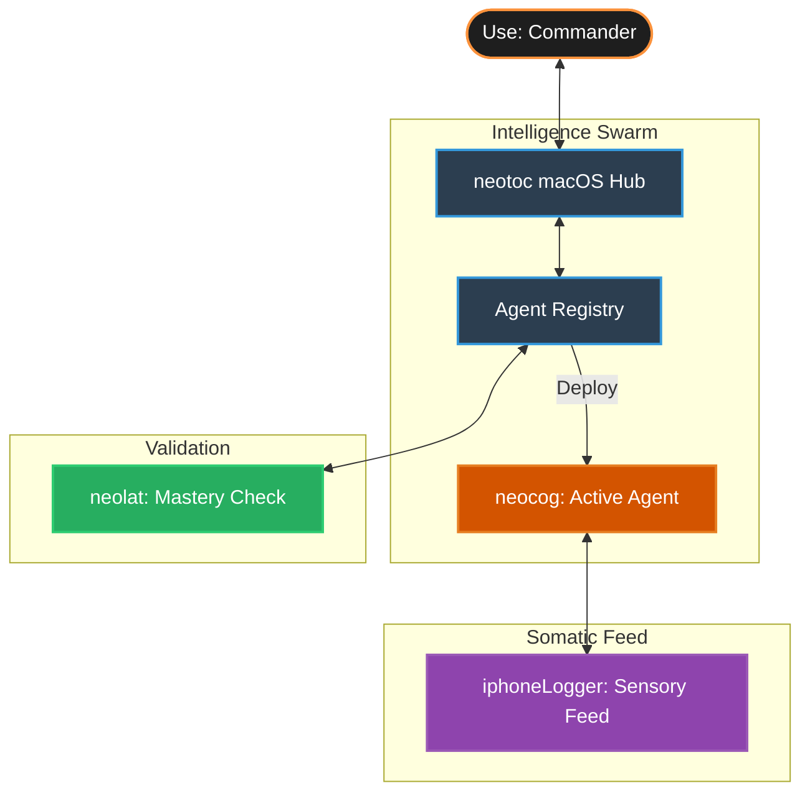

# NeoTOC: Total Operational Command 🕴️

[](https://swift.org)
[](https://developer.apple.com/macos/)
[](https://developer.apple.com/ios/)
[](LICENSE)

> **Commanding an Ecosystem of Software-Defined Agents through Active Inference.**

`NeoTOC` 🕴️ is a holistic agentic ecosystem for macOS/iOS that orchestrates a personal swarm of AI Agents via somatic context. It is a native, privacy-first intelligence ecosystem for macOS and iOS. It orchestrates a "Personal Palantir Swarm"—a collection of specialized, local sLLMs (`neocog`) that autonomously sense, critique, and act on your behalf. By grounding digital logic in physical reality, `neotoc` creates a seamless synergy between the commander (Use) and their highly specialized "Software-Defined Agents."

---

## 🎖 The Core Philosophy: From Assistant to Mastery

Traditional AI assistants are passive and monolithic. `neotoc` evolves this into a **Mastery Ecosystem**:

- **Software-Defined Agents (SDS)**: Individualized intelligence units (`neocog`) that are localized, specialized, and swappable.
- **Somatic Grounding**: Closing the loop between logic and life. Your agents "feel" your environment via high-frequency sensory feeds (`iphoneLogger`).
- **Doctrine over Design**: Commands are issued as **Rules of Engagement (ROE)**. Your agents don't just follow tasks; they uphold your personal or professional doctrine.
- **Quantitative Mastery**: A rigorous evaluation framework (`neolat`) ensures every agent in your registry meets the required mastery score before deployment.

---

## 🌟 Ecosystem Pillars

### 1. [neocog](../01_neocog): The Active Agent Kernel

The "brain" of each agent. A lightweight, decoupled kernel (2-3B sLLMs) that prioritizes **critical review** and **proactive intervention** over simple responses.

### 2. [neolat](../02_neolat): The Quantitative Crucible

The "training ground." A rigorous benchmark framework that measures the **Cognitive, Operational, Social, and Personality** mastery of every deployed agent.

### 3. [iphoneLogger](../_utils/iphoneLogger): The Somatic Sensorium

The "body." A high-frequency telemetry engine that feeds real-world physical context (stress, motion, location) directly into the agentic loop.

---

## 🏗 Holistic Architecture



---

## 🛠 Technical Stack

- **Kernel**: Apple MLX / Ollama (Accelerated for M-series NPU).
- **Control**: neocog Arbiter (Behavior Tree & ROE Interpretation).
- **Communication**: gRPC for ultra-low latency sensor ingestion.
- **Orchestration**: Internal D2A (Doctrine-to-Action) Engine + optional n8n nodes.
- **UI/UX**: SwiftUI (Native macOS/iOS) & Next.js (Dashboard & Registry Management).

---

## 🗺 Platform Roadmap

### Phase 1: Structural Synthesis (Current)

- [x] Holistic Ecosystem Design & Critical Evaluation.
- [x] Initial `neocog` D2A Kernel R&D.
- [ ] Cross-component communication protocol (gRPC) finalized.

### Phase 2: Somatic Intelligence

- [ ] Real-time integration of `iphoneLogger` streams into `neocog` internal state.
- [ ] Context-aware ROE adjustment (Automatic persona switching based on physical stress).

### Phase 3: The Mastery Marketplace

- [ ] Official `Prof` (Professional Agent) Registry launch.
- [ ] `neolat`-verified mastery scores for all community-contributed agents.

---

## 📁 Repository Structure

```text
neotoc/
├── docs/                  # Ecosystem-wide specs, PRD, and SDS
├── neocog/                # The Software-Defined Agent kernel
├── neolat/                # The Quantitative Evaluation testbed
├── iphoneLogger/          # High-frequency somatic telemetry engine
└── README.md              # Holistic platform overview
```

---

_"Intelligence that listens, then leads. Securely on your device, always by your side."_
