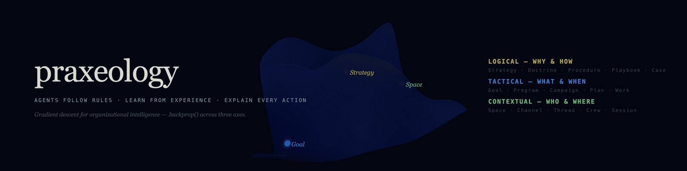

<p align="center">
  
</p>

<p align="center">
  
  
  
  
</p>

<p align="center">
  <code>pip3 install praxeology-mcp</code> · <a href="#quick-start">Quick Start</a> · <a href="docs/role-design.md">Role Design</a>
</p>

---

## The Problem

**Parallelization is solved.** Today's AI coding tools already make individual agents incredibly productive. Running 5 agents in parallel is a solved problem.

**Coordination is not.** When those 5 agents finish their work, who resolves conflicts? Who verifies consistency? Who prevents Agent A from overwriting Agent B's decisions? Who stops role drift across sessions? Multi-agent frameworks solve the *start* — Praxeology solves what comes after: **coordination, state tracking, conflict resolution, and evolutionary alignment.**

**Praxeology is the missing governance layer.** It sits above your coding tools, not replacing them — ensuring your agents operate as a coherent organization rather than a collection of independent chatbots.

It governs three axes simultaneously: **Logical** (why and how — doctrine hierarchy), **Tactical** (what and when — goal-to-task decomposition), and **Contextual** (who and where — organizational structure). Agents query all three axes to determine the right action, and feed results back via `.backprop()` — the organizational equivalent of automatic differentiation.

---

## How It Works — The Six W's

Every organizational action answers six questions: **Why, How, What, When, Who, Where.** Praxeology organizes these into 3 axes, each with 5 hierarchical layers:

```
         Logical (Why/How)        Tactical (What/When)      Contextual (Who/Where)
         ─────────────────        ────────────────────      ──────────────────────
Tier 1   Strategy                 Goal                      Space
Tier 2   Doctrine                 Program                   Channel
Tier 3   Procedure                Campaign                  Thread
Tier 4   Playbook                 Plan                      Crew
Tier 5   Case                     Work                      Session
```

**Forward Pass — Acting:**
An agent receives a task (Work). It checks relevant Playbooks and Procedures for how to act, verifies against Doctrine constraints, and executes within its Session context. This is the normal flow — top-down governance guiding action.

**Backward Pass — Learning (`.backprop()`):**
When the result surprises — a rule was missing, a plan didn't match reality, or a task fell outside someone's authority — the feedback propagates *backward* through all 3 axes simultaneously:
- **Logical:** Case → Playbook gap → Procedure review → Doctrine amendment
- **Tactical:** Work result → Plan adjustment → Campaign reprioritization → Goal reassessment
- **Contextual:** Session learning → Crew skill update → Thread reassignment → Channel restructuring

Higher tiers are stable; lower tiers absorb most changes. Only significant surprises propagate upward — like waves on the surface while the deep ocean stays calm.

---

## What Makes It Different

Not a feature list. A coordination problem solver.

| Your Problem | Praxeology's Answer |
|---|---|
| Agents drift from their role over sessions | **ConstitutionalGuard** — behavioral verification against all 3 axes |
| No way to safely constrain agent actions | **SafetyGate** — Higher tiers lock critical rules that lower tiers cannot override |
| Agents can't improve their own processes | **SOP Evolution** — `.backprop()` loop. Gradient descent for governance |
| Changes in one place break another | **Review Cascade** — Bidirectional propagation across all 3 axes |
| Agents can't flag when rules are bad | **Proposal Flow** — Structured amendment requests from any agent to the founder |
| No institutional memory across sessions | **Case Memory** — Every execution recorded as a Case, searchable for future decisions |
| Agents don't know what to do next | **`what_now()`** — Cross-axis recommendation engine that finds the highest-value action |

---

## Quick Start

```bash
git clone https://github.com/neomakes/praxeology.git
cd praxeology
./setup.sh                                  # Python check, venv, install, CLI setup — one command
praxeology init --name MyOrg --agents 3     # Generates CLAUDE.md, _crew/, _standard/, .mcp.json, DB
```

That's it. Claude Code auto-loads `.mcp.json` — your agents immediately get 20 governance tools. Ask any agent: `what_now()`

---

## Agent Design System

Every agent gets a `CLAUDE.md` that defines not just *what* it does, but *how* it behaves:

```
Identity → Persona → Speech Rules → Anti-Patterns → Emotional Triggers → Values → Boundaries
```

This makes agents **distinguishable, consistent, and bounded**. A QA agent sounds different from an executor. A planner never writes code. A reviewer never approves their own work. See [Role Design Guide](docs/role-design.md) for the full template and scaling strategies (3 to 15+ agents).

---

## MCP Server — Praxeology Runtime

Praxeology v1 is a document framework. The MCP server makes it a **runtime** — agents can search doctrine, track objectives, record cases, detect gaps, and evolve their own governance.

### Installation

```bash
git clone https://github.com/neomakes/praxeology.git
cd praxeology
./setup.sh    # Creates venv, installs deps, adds 'praxeology' to PATH
```

Requires Python 3.10+. On macOS: `brew install python@3.12` if needed.

### 20 MCP Tools — 3 Axes × 5 Operations + 2 Cross-Axis + 3 Metrics

| Axis | search | read | create | escalate | feedback |
|------|--------|------|--------|----------|----------|
| **Logical** (Why/How) | Search standards & cases | Read with history | Create standard/case/gap/proposal | Flag for review | Record result + surprise |
| **Tactical** (What/When) | Search objectives | Read with parent chain | Create goal→work hierarchy | Block + notify parent | Update status |
| **Contextual** (Who/Where) | Search org structure | Read crew + access | Create space→session | Delegate to other crew | Record KPI review |

**Cross-Axis:**
- `what_now(crew_id)` — "What should I do right now?" Recommends highest-value action by cross-referencing all 3 axes.
- `backprop(case_id, result, surprise)` — The organizational equivalent of automatic differentiation. Records execution result and propagates feedback simultaneously to all 3 axes: updates doctrine (Logical), adjusts plans (Tactical), and logs crew performance (Contextual). High surprise auto-creates gaps; very high surprise auto-generates amendment proposals. Over time, this is gradient descent for governance.

**Metrics:**
- `metrics_summary(period)` — Aggregate tool usage, token cost, and latency for a given period.
- `metrics_compare(period1, period2)` — Side-by-side comparison to prove cost decreases with use.
- `metrics_trend(metric, days)` — Time-series trend for any metric — the evidence that `.backprop()` works.

### Heartbeat Engine

Built-in 2-tier background check:
- **Lightweight** (rule-based, cost = 0): Checks pending work, overdue schedules, open gaps
- **Heavyweight** (LLM, triggered only when needed): Evaluates whether action is required

Over time, as gaps are absorbed into doctrine, more situations are handled by the lightweight tier — **cost decreases with use**.

---

## CLI Commands

```bash
praxeology init --name MyOrg --agents 3   # Bootstrap new project
praxeology init --existing                  # Add MCP to existing Praxeology v1 project
praxeology migrate --project-dir .          # Import .md standards, todo/weekly.json, crew CLAUDE.md into DB
praxeology heartbeat start                  # Start background heartbeat daemon
praxeology heartbeat stop                   # Stop heartbeat daemon
praxeology dashboard                        # Launch web dashboard (localhost:5060)
praxeology status                           # Show DB stats and heartbeat status
```

---

## The Theory — Why This Works

The same 5-tier × 3-axis structure appears across every domain of organized action:

**Logical Axis — WHY & HOW** (rules that govern action)

| Tier | National Law | Military | Corporate | Praxeology MCP |
|------|-------------|----------|-----------|----------------|
| **1** | Constitution | National Defense Strategy | Articles of Incorporation | **Strategy** |
| **2** | Statute Law | Operational Doctrine | Corporate Regulations | **Doctrine** |
| **3** | Decree / Rules | OPLAN / OPORD | Operating Guidelines | **Procedure** |
| **4** | Administrative Rules | TTP | SOP / Best Practices | **Playbook** |
| **5** | Enforcement | FRAGO | Work Execution | **Case** |

**Tactical Axis — WHAT & WHEN** (objectives that decompose into action)

| Tier | National Plan | Military | Corporate | Praxeology MCP |
|------|-------------|----------|-----------|----------------|
| **1** | National Vision | End State | Mission / OKR | **Goal** |
| **2** | 5-Year Plan | Campaign Plan | Annual Program | **Program** |
| **3** | Annual Budget | Operation | Quarterly Initiative | **Campaign** |
| **4** | Project Plan | Mission | Sprint / Weekly Plan | **Plan** |
| **5** | Task Execution | Engagement | Daily Todo | **Work** |

**Contextual Axis — WHO & WHERE** (organization that contains action)

| Tier | National Org | Military | Corporate | Praxeology MCP |
|------|-------------|----------|-----------|----------------|
| **1** | Nation | Theater | Company | **Space** |
| **2** | Ministry | Corps / Division | Department | **Channel** |
| **3** | Bureau | Battalion / Unit | Team / Project | **Thread** |
| **4** | Office | Soldier | Employee / Agent | **Crew** |
| **5** | Desk / Shift | Watch / Patrol | Work Session | **Session** |

The pattern is universal. In Praxeology MCP, every **Case** is a 3-axis junction — it references a standard (Logical), an objective (Tactical), and a crew member in a session (Contextual). `.backprop()` propagates feedback through all three simultaneously, like gradient descent across the organizational manifold.

---

## Package Structure

```
praxeology-mcp/                # pip3 install praxeology-mcp
├── praxeology_mcp/
│   ├── server.py              # FastMCP entry point
│   ├── db.py                  # SQLite schema + FTS5 + migrations
│   ├── cross.py               # Cross-axis tools (what_now, backprop)
│   ├── heartbeat.py           # 2-tier background daemon
│   ├── metrics.py             # metrics_summary, metrics_compare, metrics_trend
│   ├── cli.py                 # CLI (init, migrate, heartbeat, dashboard, status)
│   ├── axes/                  # Per-axis tool modules
│   │   ├── logical.py         # Logical axis (WHY/HOW)
│   │   ├── tactical.py        # Tactical axis (WHAT/WHEN)
│   │   └── contextual.py      # Contextual axis (WHO/WHERE)
│   └── dashboard/             # Web dashboard (FastAPI)
│       ├── app.py             # Routes + localhost-only auth middleware
│       └── templates/         # Jinja2 HTML templates
└── pyproject.toml
```

## Generated Project Structure

`praxeology init` generates the following in your project directory:

```
your-project/
├── CLAUDE.md                  # Root context for AI agents
├── .mcp.json                  # MCP server configuration
├── _standard/                 # Governance documents (optional, for migration)
│   └── {department}/
│       └── STR/DOC/PRC/PLY-{NNN}.md
└── _crew/                     # Agent definitions (optional, for migration)
    ├── CLAUDE.md              # Shared crew rules
    └── {agent}/
        └── CLAUDE.md          # Agent context and persona

~/.claude/praxeology/
└── praxeology.db              # SQLite database (auto-created, all runtime data lives here)
```

`_standard/` and `_crew/` are **optional source files** for bootstrapping. After `praxeology migrate`, all data lives in the SQLite database. You can manage everything through MCP tools without these directories.

---

## Data Architecture

Praxeology MCP stores everything in a single SQLite database with FTS5 full-text search:

| Axis | Tables | Purpose |
|------|--------|---------|
| **Logical** | `standards`, `cases`, `gaps`, `proposals` | Governance documents, execution records, detected gaps, amendment proposals |
| **Tactical** | `objectives`, `schedules` | Goal→Work hierarchy, time-based triggers |
| **Contextual** | `contexts`, `reviews`, `delegations`, `channel_access` | Org structure, performance reviews, task delegation |
| **Cross** | `metrics_log` | Tool usage, token cost, latency — auto-logged on every MCP call |

Every **Case** is a 3-axis junction: it links a `standard_id` (Logical), `objective_id` (Tactical), and `crew_id` + `session_id` (Contextual). This is how `.backprop()` propagates feedback through all three axes simultaneously.

---

## Origin & Production Use

Built by **[NeoMakes](https://neomakes.com)** — a one-person company developing human-AI interaction technologies for extreme mission environments. The framework emerged from governing a fleet of 9 AI agents across 7 departments with 38 governance rules, using the same rigor applied to military command structures.

In daily production: agents detect gaps in their own procedures, propose amendments, and evolve their SOPs through the `.backprop()` loop. Each agent has defined Speech Rules, Anti-Patterns, and Emotional Triggers — making them distinguishable, consistent, and bounded.

The name comes from praxeology, the study of human action. Purposeful action has structure. That structure is universal. Make it explicit, and you can govern anything.

---

## License

GNU Affero General Public License v3.0 — see [LICENSE](LICENSE).

Copyright (c) 2026 NeoMakes
